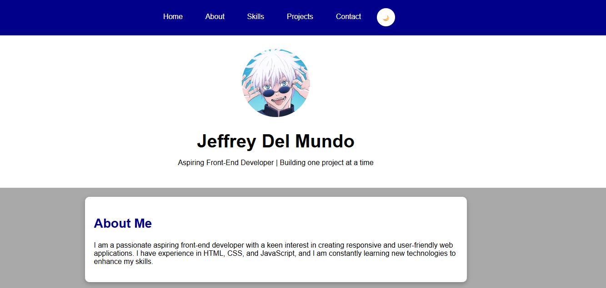

# Porftolio V1

My first portfolio project built from scratch using HTML, CSS, and JavaScript. It showcases my frontend development journey, clean responsive design, and interactive features.

## Features

- Responsive Design: Fits well on both desktop and mobile screen.
- Dark Mode Toggle: Smooth switching between light and dark themes.
- Interactive Proejct Cards: Hover and click interactions for featured projects.
- Contact Section: Interactive contact form with validation and character counter.

## Technologies Used

- HTML
- CSS
- JavaScript

## Live Demo

[View Portfolio](https://jeffroca7-ops.github.io/portfolio-v1/)

## Tools

- Visual Studio Code
- Git
- Github

## About This Project

I created this project while learning the fundamentals of front-end web development. Its primary goal is to practice and apply my knowledge of HTML, CSS, and JavaScript in building a real-world project. I plan to continuously improve and add more features to this portfolio as I advance my coding skills.

## Preview

